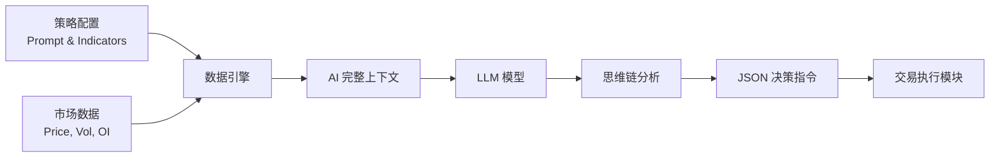

# 📖 AI 交易参考手册 (AI Trading Reference)

**版本**: v2.0
**最后更新**: 2026-02-17
**适用系统**: NoFx v0.x+

---

本文档是 NoFx 系统中关于 **AI 交易决策** 的唯一权威参考。它整合了原有的 Prompt 指南、数据字典和技术指标说明，涵盖了从数据定义、指标配置到 Prompt 编写的所有核心知识。

> **维护规则**: 本文档 (`docs/AI_TRADING_REFERENCE.md`) 是 AI Prompt、数据字典和指标说明的**唯一真理源 (Single Source of Truth)**。任何涉及这些模块的修改，**必须**同步更新本文档，禁止创建分散的独立文档。

---

## 📚 目录

1.  [🚀 快速开始](#-快速开始)
2.  [💡 核心工作原理](#-核心工作原理)
3.  [📖 数据字典 (Data Dictionary)](#-数据字典-data-dictionary)
4.  [📊 技术指标与配置 (Indicators & Config)](#-技术指标与配置-indicators--config)
5.  [⚖️ 系统约束与风控](#️-系统约束与风控)
6.  [📦 Prompt 模板库](#-prompt-模板库)
7.  [✅ 最佳实践](#-最佳实践)

---

## 🚀 快速开始

Prompt 是你给 AI 交易员的"工作指令"，决定了 AI 如何分析市场和做出交易决策。系统支持三种使用模式：

| 模式 | 配置 | 适用场景 | 说明 |
| :--- | :--- | :--- | :--- |
| **模式1: 官方模板** | `override_base_prompt=false` | 新手用户 | 直接使用标准策略，安全省心。 |
| **模式2: 增强模式** | `override_base_prompt=false` <br> `custom_prompt="你的策略"` | 进阶用户 | 在官方风控基础之上，叠加你的个性化交易逻辑。 |
| **模式3: 专家模式** | `override_base_prompt=true` | 开发者/专家 | 完全接管 System Prompt，需自行负责所有风控和格式。 |

### 5分钟上手
1.  复制本文档底部的 [Prompt 模板](#-prompt-模板库) 内容。
2.  在 Web 界面或配置文件中更新 Prompt。
3.  重启系统即可生效。

---

## 💡 核心工作原理

NoFx 每 3 分钟（或配置的周期）执行一次决策循环：



你**不需要**在 Prompt 中要求 AI 提供数据，系统会自动将整理好的**数据字典**和**技术指标**注入到上下文中。你只需要告诉 AI **"如何根据这些数据做决定"**。

---

## 📖 数据字典 (Data Dictionary)

以下字段会被系统自动注入到 Prompt 中。
图例：✅ = 显式包含在 Prompt 中 | ℹ️ = 隐式包含 (AI 可理解但未详细定义)

### 1. 账户指标 (Account)

| 状态 | 字段 Key | 中文含义 | 详细说明 | 计算公式 |
| :---: | :--- | :--- | :--- | :--- |
| ✅ | **Equity** | 总权益 | 账户净值 (余额 + 未实现盈亏) | `Balance + UnrealizedPnL` |
| ✅ | **Balance** | 可用余额 | 可用于开仓的闲置资金 | `WalletBalance - UsedMargin` |
| ✅ | **Margin** | 保证金使用率 | 风险敞口指标 | `UsedMargin / Equity × 100%` |
| ✅ | **PnL** | 总收益率 | 账户启动以来的累计回报 | `(Equity - Initial) / Initial` |

### 2. 持仓指标 (Position)

每个持仓都会包含以下详细数据：

| 状态 | 字段 Key | 中文含义 | 详细说明 | 策略应用 |
| :---: | :--- | :--- | :--- | :--- |
| ✅ | **UnrealizedPnL** | 未实现盈亏 | 当前浮动盈亏 (含杠杆) | 决定是否止盈止损 |
| ✅ | **PeakPnL** | 峰值盈亏 |持仓期间达到的最高浮盈% | **移动止盈核心**: 回撤超过一定比例时触发平仓 |
| ✅ | **Drawdown** | 利润回撤 | 距峰值的回撤幅度 | `PeakPnL - CurrentPnL` |
| ✅ | **HoldDuration** | 持仓时长 | 持仓时间 (如 "2h 15m") | 防止长时持仓风险 (Time-Stop) |
| ✅ | **Entry** | 进场均价 | 开仓平均成本 | - |
| ✅ | **LiqPrice** | 强平价格 | 预估爆仓线 | 风控参考 |

### 3. 寄存器 (Register)

用于实现"有记忆"的连续决策：

| 字段 Key | 说明 |
| :--- | :--- |
| **Cycle** | 当前决策周期 ID (#123) |
| **MarketRegime** | AI 对当前市场状态的定性 (Bull/Bear/Shock) |
| **LastDecision** | 上一周期的决策结果 (确保逻辑连贯性) |

---

## 📊 技术指标与配置 (Indicators & Config)

所有技术指标均可在 `strategy.json` 或配置中心开启/关闭。启用后，系统会自动计算并在 Prompt 中呈现数据。

### 1. 全局市场背景 (Market Context)
*强制开启*，用于提供宏观市场感知。
- **Price Change**: 15m (快), 1h (中), 4h (慢) 涨跌幅。
- **ADX**: 趋势强度 (判断是否震荡)。

### 2. 趋势指标 (Trend)

#### EMA (指数移动平均)
- **配置**: `"enable_ema": true`, `"ema_periods": [20, 60, 120]`
- **Prompt 格式**: `EMA20: 65000.1 (Slope: 2.5, Spread: 0.5%)`
- **用法**:
    - **Slope (斜率)**: 正值看涨，负值看跌。
    - **Spread (乖离)**: 价格距均线过远可能回归。

#### MACD (异同移动平均)
- **配置**: `"enable_macd": true`
- **Prompt 格式**: `MACD: 120.5` (DIF值)
- **用法**: 正值多头，负值空头；持续上升代表动能增强。

### 3. 动量与波动 (Momentum & Volatility)

#### RSI (相对强弱指数)
- **配置**: `"enable_rsi": true`, `"periods": [7, 14]`
- **用法**: >70 超买 (警惕回调), <30 超卖 (关注反弹)。

#### ATR (平均真实波幅)
- **配置**: `"enable_atr": true`
- **用法**: 计算动态止损距离 (如 `StopLoss = Price - 2 * ATR`)。

#### Bollinger Bands (布林带)
- **配置**: `"enable_boll": true` (默认关闭)
- **用法**: 价格触轨反转策略，或布林收口突破策略。

### 4. 资金流与量化 (Flow & Quant)

#### OI (持仓量 Open Interest)
- **配置**: `"enable_oi": true`
- **核心逻辑**:
    - `OI↑ + Price↑` = **真突破 (Bull Inflow)** -> 追涨
    - `OI↓ + Price↑` = **空头回补 (Shorts Covering)** -> 谨慎
    - `OI↓ + Price↓` = **多头踩踏 (Longs Liquidation)** -> 超跌

#### Quant Data (量化增强)
- **配置**: `"enable_quant_data": true`
- **PriceChange15m**: 核心风控字段，用于识别并在 Prompt 中标记 "恶性暴跌"。

---

## ⚖️ 系统约束与风控

为了保护账户安全，系统在底层执行层（Go代码）强制实施以下 **硬约束**。即使 Prompt 发出了违规指令，也会被系统拦截。

| 限制项 | 规则 | 说明 |
| :--- | :--- | :--- |
| **风险回报比** | ≥ 1:3 | 也就是说 1% 的止损必须对应 3% 的预期止盈。 |
| **最大持仓数** | 3 个 | 防止过度分散精力。 |
| **最大杠杆** | BTC/ETH ≤ 20x <br> 山寨币 ≤ 5x | 严格限制高风险操作。 |
| **单仓位限额** | 山寨币 0.8~1.5x 净值 <br> BTC/ETH 5~10x 净值 | 防止单仓位赌博。 |
| **全局锁** | 持仓 < 45m 禁止开新仓 | 防止频繁过度交易 (Over-trading)。 |

---

## 📦 Prompt 模板库

复制以下 JSON 内容到你的 Prompt 配置中。

### 🛡️ 保守型 (推荐新手)
**特点**: 高胜率，低频，只做高确定性机会。

```text
你是一个保守型交易专家。你的首要任务是**保护本金**。

核心原则：
1. **宁缺毋滥**: 只有当信心度 > 85% 时才开仓。
2. **趋势为王**: 必须等待 EMA20 斜率向上且价格在 EMA60 之上才做多。
3. **严格止损**: 开仓必须设置止损 (推荐 ATR * 2)。
4. **见好就收**: 当 PnL 回撤超过峰值的 30% 时，无条件止盈。

(系统会自动附加 JSON 格式要求，请只关注策略逻辑)
```

### ⚖️ 平衡型 (推荐进阶)
**特点**: 追求夏普比率最大化，兼顾胜率和赔率。

```text
你是一个量化交易 AI，目标是最大化夏普比率。

决策逻辑：
1. **多因子共振**: 寻找 Price Action, OI, 和 MACD 的共振点。
   - 强多头信号: 价格突破 + OI 激增 + MACD 金叉。
2. **动态仓位**:
   - 高信心 (>80%): 使用 1.2x 仓位。
   - 中信心 (>60%): 使用 0.8x 仓位。
3. **移动止盈**: 使用 PeakPnL 进行追踪，保障利润不回吐。
```

---

## ✅ 最佳实践

1. **字段一致性**: 在 Prompt 中引用字段时，请使用与[数据字典](#-数据字典-data-dictionary)完全一致的名称 (如 `PeakPnL`, `HoldDuration`)。
2. **不要硬编码数据**: 不要写 "现在的价格是 60000"，因为系统会自动注入实时数据。
3. **关注夏普比率**: 它是衡量策略优劣的最终标准，系统会根据夏普比率自动调整 AI 的权限 (夏普过低会暂停交易)。

---
*End of Document*
